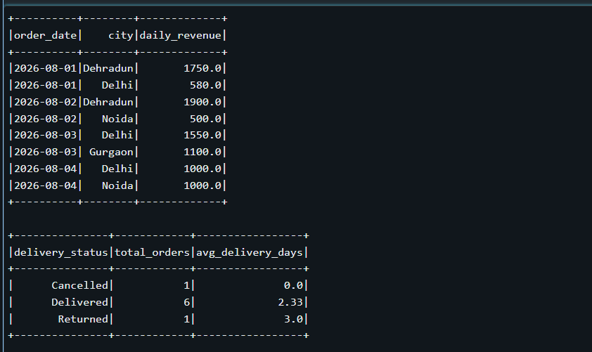
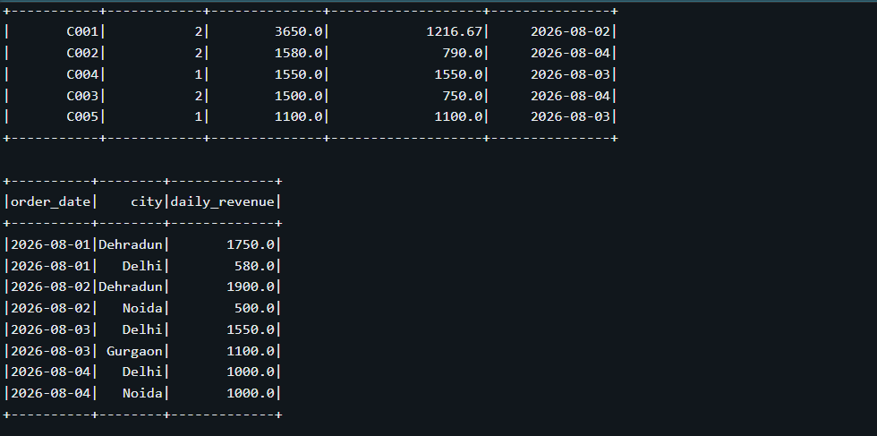
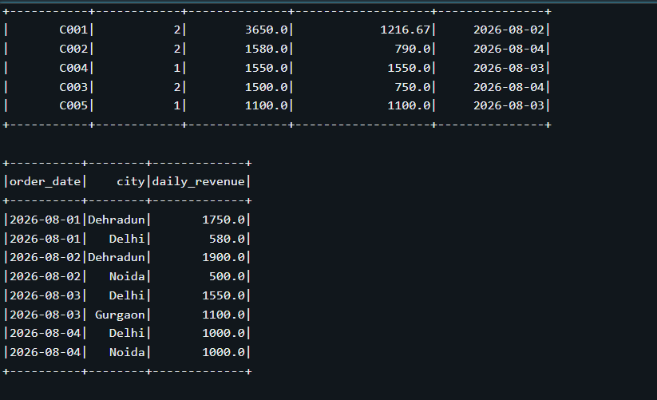

# FreshMart Data Pipeline

An end-to-end batch data pipeline built using Databricks, PySpark, and Delta Lake.

## Project Overview

This project processes FreshMart retail data through a Bronze, Silver, and Gold architecture. The pipeline ingests raw CSV and JSON files, performs data cleaning and quality checks, and creates business-ready datasets for analysis.

## Architecture

Raw CSV / JSON
        ↓
Bronze Layer
        ↓
Silver Layer
        ↓
Gold Layer
        ↓
Business Metrics

## Technologies Used

- Databricks
- PySpark
- Python
- Delta Lake
- SQL
- Unity Catalog

## Data Sources

The pipeline uses the following datasets:

- Orders
- Order Items
- Customers
- Delivery Logs

## Bronze Layer

The Bronze layer stores the ingested data as Delta tables with minimal transformation.

Tables:

- `orders`
- `order_items`
- `customers`
- `delivery_logs`

## Silver Layer

The Silver layer prepares clean and reliable data for analysis.

Key transformations:

- Data type casting
- Duplicate removal
- Null handling
- Data quality validation
- PII masking
- Standardization of columns

## Gold Layer

The Gold layer contains business-level datasets and metrics.

### Daily Revenue by City

Calculates daily revenue grouped by city.

### Delivery Performance

Analyzes delivery status, order count, and average delivery time.

### Product Return Rates

Calculates product-level return rates.

### Customer Summary

Provides customer-level metrics such as total orders, total spending, average order value, and last order date.

## Gold Tables

- `daily_revenue_city`
- `delivery_performance`
- `product_return_rates`
- `customer_summary`

## Data Quality Checks

The pipeline validates:

- Null Order IDs
- Duplicate Order IDs
- Invalid quantity values
- Null Customer IDs

## Project Structure

```text
FreshMart-Data-Pipeline/
│
├── README.md
│
├── data/
│   ├── orders.csv
│   ├── order_items.csv
│   ├── customers.json
│   └── delivery_logs.json
│
├── notebooks/
│   ├── 01_Bronze_Ingestion
│   ├── 02_Silver_Transformation
│   └── 03_Gold_Aggregations
│
└── docs/
    └── architecture.md
## Project Screenshots

### Gold Layer – Customer Summary


### Gold Layer – Daily Revenue by City


### Gold Layer – Delivery Performance

